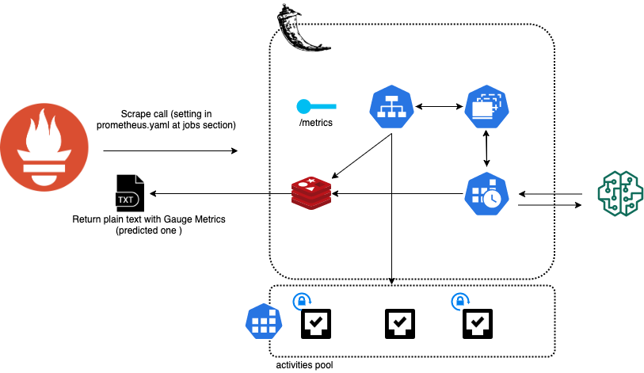

### k8s-anomaly-detector: Kubernetes Anomaly Detection System

k8s-anomaly-detector is based on AICoE project from Prometheus anomaly detection system. 

Using time series generation forecasting algorithms, the system expose to Prometheus Scrape forecasted metrics.
During the scraping from Prometheus, this metrics are retrieved and compared:
if an anomaly is detected the system manage specific "activities" in order to reimplement and manage the anomaly.

Activities are defined using YAML configurations files, here are an example:

```yaml
activities:
  - name: "my_activity_name"
    command:
      shell_file: myscript.sh
      args:
        - myarg1
        - myarg2
```

Activities directly depends on enviroment.yaml file and "prometheus_metric_list" parameter:

```yaml
prometheus_metric_list:
  - metric_query: "myquery"
    predicted_metric_name: "my_activity_name"
```

When an anomaly is detected during the metrics scraping by Prometheus, the activity is called if it's declared,
and the system run the target script in the form: 

```shell script
/bin/sh ./myscript.sh myarg1 myarg2
```

While the script is launched, a separeted thread is responsable for the
execution of the thread and the relative management and a flag is added for not relaunching it until the next clean(lock system)

The script so is launched and permits us to integrate and act in order to automize anomaly detection management

"Locks" are cleaned by the event system, responable to clean lock for metrics in specific events:

- onRetraining -> lock are clean during retrain, so the activity start if the anomaly is already active [DONE]
- onAnomalyChangeStatus -> lock are clean when the anomaly change status, so activity is triggered if anomaly is detected and until the anomaly status return to 0 activity is not retriggered
  [TODO]
  
# Architecture:


  
# TODO Activities:

- Event management for locking sysstem
- Expose lock and activities endpoint
- Add kNN algorithm for decisional system
- Add permission to sh commands
- Support python scripts
- Move all in conda environment

Launching commands:
- helm upgrade --install k8s-anomaly-detector . --namespace staging -f values.yaml --version 1.0.0 --debug
- helm delete --purge k8s-anomaly-detector
  

In order to develop locally with k8s-anomaly-detector you need to run: 

- `kubectl port-forward` to Prometheus instance -> `k port-forward ${YOUR_PROMETHEUS_K8S_SERVICE} 9090:9090`
- `make start` -> for running k8s-anomaly-detector and redis container
